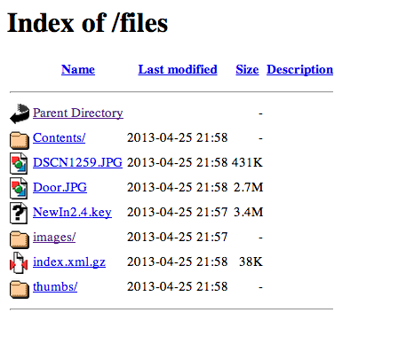

.. _Chapter_url_mapping:

===========
URL Mapping
===========

.. epigraph::

   | Some people are heroes. And some people jot down notes.
   | Sometimes they're the same person.

   -- Terry Pratchett, *The Truth*

.. index:: URL Mapping

In this chapter, we'll discuss the various ways that the Apache http
server (httpd) handles URL Mapping.

.. _introduction-to-url-mapping:

.. index:: pair: URL mapping; introduction

When the Apache http server receives a request, it is processed in a
variety of ways to see what resource it represents. This process is
called URL Mapping.

:module:`mod_rewrite` is part of this process, but will be handled separately,
since it is a large portion of the contents of this book.

The exact order in which these steps are applied may vary from one
configuration to another, so it is important to understand not only the
steps, but the way in which you have configured your particular server.

.. _mod_rewrite:

.. index:: mod_rewrite
.. index:: pair: modules; mod_rewrite

mod_rewrite
~~~~~~~~~~~

:module:`mod_rewrite` is perhaps the most powerful part of this process. That is,
of course, why it features prominently in the name of this book.

For now, we'll just say that :module:`mod_rewrite` fills a variety of different
roles in the URL mapping process. It can, among other things, modify a
URL once it is received, in many different ways.

While this usually happens before the other parts of URL mapping, in
certain circumstances, it can also perform that rewriting later on in
the process.

This, and much more, will be revealed in the coming chapters.

.. _documentroot:

.. index:: DocumentRoot
.. index:: pair: directives; DocumentRoot
.. index:: file-system path

DocumentRoot
~~~~~~~~~~~~

The DocumentRoot directive specifies the filesystem directory from which
static content will be served. It's helpful to think of this as the
default behavior of the Apache http server when no other content source
is found.

Consider a configuration of the following:

.. code-block:: apache

   DocumentRoot /var/www/html

With that setting in place, a request for
<http://example.com/one/two/three.html> will result in the file
/var/www/html/one/two/three.html being served to the client with a MIME
type derived from the file name - in this case, text/html.

.. _directoryindex:

.. index:: DirectoryIndex
.. index:: pair: directives; DirectoryIndex

DirectoryIndex
~~~~~~~~~~~~~~

The DirectoryIndex directive specifies what file, or files, will be
served in the event that a directory is requested. For example, if you
have the configuration:

.. code-block:: apache

   DocumentRoot /var/www/html
   DirectoryIndex index.html index.php

Then when the URL <http://example.com/one/two/> is requested, Apache
httpd will attempt to serve the file /var/www/html/index.html and, if
it's not able to find that, will attempt to serve the file
/var/www/html/index.php.

If neither of those files is available, the next thing it will try to do
is serve a directory index.

.. _fallbackresource:

.. index:: FallbackResource
.. index:: pair: mod_dir; FallbackResource
.. index:: front controller

FallbackResource
~~~~~~~~~~~~~~~~

The ``FallbackResource`` directive, provided by :module:`mod_dir`, defines a
default resource to serve when a request doesn't map to any existing
file in the filesystem. This is the mechanism behind the "front
controller" pattern used by virtually every modern web framework — Laravel,
Symfony, WordPress, Drupal, and many others.

Before ``FallbackResource`` existed (it was introduced in httpd 2.2.16),
the standard way to implement a front controller was a :module:`mod_rewrite`
rule like this:

.. code-block:: apache

   RewriteEngine On
   RewriteCond %{REQUEST_FILENAME} !-f
   RewriteCond %{REQUEST_FILENAME} !-d
   RewriteRule ^ /index.php [L]

That four-line incantation — "if it's not an existing file or directory,
send it to :file:`index.php`" — appears in countless :file:`.htaccess` files
across the web. ``FallbackResource`` replaces it with a single line:

.. code-block:: apache

   FallbackResource /index.php

Existing files — images, CSS, JavaScript, static HTML — are served
normally. Only requests that would otherwise produce a 404 are routed
to the specified resource. The original request URL is available to the
handler via the ``REQUEST_URI`` server variable.

If the front controller lives in a subdirectory, specify the full
path:

.. code-block:: apache

   <Directory "/var/www/html/app">
       FallbackResource /app/index.php
   </Directory>

You can disable ``FallbackResource`` in a child directory to prevent
inheritance — useful for directories that should return a genuine 404
when a file isn't found:

.. code-block:: apache

   <Directory "/var/www/html/app/static">
       FallbackResource disabled
   </Directory>

If you find yourself writing a ``RewriteCond !-f`` / ``RewriteCond !-d``
pair, stop and consider ``FallbackResource`` first. It's simpler, faster
(no regex engine involved), and communicates the intent much more
clearly. Save :module:`mod_rewrite` for cases where you need to transform the
URL, not merely route it.

.. _automatic-directory-listings:

.. index:: mod_autoindex
.. index:: pair: modules; mod_autoindex
.. index:: directory listings
.. index:: pair: directives; Options
.. index:: pair: directives; IndexOptions

Automatic directory listings
~~~~~~~~~~~~~~~~~~~~~~~~~~~~

The module :module:`mod_autoindex` serves a file listing for any directory that
doesn't contain a DirectoryIndex file. (See section
:ref:`directoryindex` above.)

To permit directory listings, you must enable the Indexes setting of the
Options directive:

.. code-block:: apache

   Options +Indexes

See the documentation of the Options
<http://httpd.apache.org/docs/current/mod/core.html#options> for further
discussion of that directive.

If the Indexes option is on, then a directory listing will be displayed,
with whatever features are enabled by the IndexOptions directive.

Typically, a directory will look like the example shown below.

For further discussion of the autoindex functionality, consult the
:module:`mod_autoindex` documentation at
<http://httpd.apache.org/docs/current/mod/:module:`mod_autoindex`.html>.

_Future versions of this book will include more detailed information
about directory listings._

.. _alias:

.. index:: Alias
.. index:: pair: directives; Alias
.. index:: ScriptAlias
.. index:: pair: directives; ScriptAlias
.. index:: pair: modules; mod_alias

Alias
~~~~~

The Alias directive is used to map a URL to a directory path outside of
your DocumentRoot directory.

.. code-block:: apache

   Alias /icons /var/www/icons

An Alias is usually accompanied by a <Directory> stanza granting httpd
permission to look in that directory. In the case of the above Alias,
for example, add the following:

.. code-block:: apache

   <Directory /var/www/icons>
     Require all granted
   </Directory>

Or, if you're using httpd 2.2 or earlier:

.. code-block:: apache

   <Directory /var/www/icons>
     Order allow,deny
     Allow from all
   </Directory>

There's a special form of the Alias directive - ScriptAlias - which has
the additional property that any file found in the referenced directory
will be assumed to be a CGI program, and httpd will attempt to execute
it and sent the output to the client.

CGI programming is outside of the scope of this book. You may read more
about it at http://httpd.apache.org/docs/current/howto/cgi.html

.. _aliasmatch:

.. index:: AliasMatch
.. index:: ScriptAliasMatch
.. index:: pair: mod_alias; AliasMatch
.. index:: pair: mod_alias; ScriptAliasMatch

AliasMatch and ScriptAliasMatch
~~~~~~~~~~~~~~~~~~~~~~~~~~~~~~~

``AliasMatch`` and ``ScriptAliasMatch`` are regex-capable versions of
``Alias`` and ``ScriptAlias``. They allow you to use regular expressions
to match the URL and use backreferences in the target path.

For example, to map user CGI directories without :module:`mod_userdir`:

.. code-block:: apache

   ScriptAliasMatch "^/~([a-zA-Z0-9]+)/cgi-bin/(.+)" "/home/$1/cgi-bin/$2"

A request for ``http://example.com/~alice/cgi-bin/stats.pl`` would
execute :file:`/home/alice/cgi-bin/stats.pl`.

Similarly, ``AliasMatch`` can map patterns of URLs to filesystem
locations:

.. code-block:: apache

   AliasMatch "^/docs/([a-z]{2})/" "/srv/docs/$1/"

This maps :file:`/docs/en/` to :file:`/srv/docs/en/`, :file:`/docs/fr/` to
:file:`/srv/docs/fr/`, and so on.

A common gotcha: unlike ``Alias``, which treats the URL prefix as a
literal string, ``AliasMatch`` consumes the entire URL-path during the
match. If you're not careful with your regex, you may capture more or
less than you intended. Use anchors (``^`` and ``$``) and be deliberate
about what your groups capture.

.. _redirect:

.. index:: Redirect
.. index:: pair: directives; Redirect
.. index:: RedirectMatch
.. index:: pair: HTTP status codes; 301 Moved Permanently

.. index:: Redirect
.. index:: pair: mod_alias; Redirect
.. index:: RedirectMatch
.. index:: pair: mod_alias; RedirectMatch
.. index:: 301 redirect
.. index:: 302 redirect

Redirect
~~~~~~~~

The purpose of the Redirect directive is to cause a requested URL to
result in a redirection to a different resource, either on the same
website or on a different server entirely.

The Redirect directive results in a Location header, and a 30x status
code, being sent to the client, which will then make a new request for
the specified resource.

The exact value of the 30x status code will influence what the client
does with this information, as indicated in the table below:

.. list-table::
   :header-rows: 1
   :widths: auto

   * - Code
     - Meaning
   * - 300
     - Multiple Choice - Several options are available
   * - 301
     - Moved Permanently
   * - 302
     - Temporary Redirect
   * - 304
     - Not Modified - use whatever version you have cached

Other 30x statuses are available, but these are the only ones we'll
concern ourselves with at the moment.

The syntax of the Redirect directive is as follows:

.. code-block:: apache

   Redirect [status] RequestedURL TargetUrl

.. _redirectmatch:

.. index:: pair: mod_alias; RedirectMatch

RedirectMatch
~~~~~~~~~~~~~

``RedirectMatch`` is the regex-capable counterpart to ``Redirect``. It
allows you to match the requested URL against a regular expression and
use backreferences in the target URL.

For example, to redirect an entire directory tree while preserving the
path structure:

.. code-block:: apache

   RedirectMatch 301 "^/oldsite/(.*)" "https://newsite.example.com/$1"

This redirects :file:`/oldsite/page.html` to
``https://newsite.example.com/page.html``, and so on for any path
under :file:`/oldsite/`.

Another common use is stripping or adding file extensions:

.. code-block:: apache

   RedirectMatch 301 "^/(.+)\.htm$" "/$1.html"

``RedirectMatch`` is often a simpler and more appropriate choice than
a ``RewriteRule`` with the ``[R]`` flag when all you need is a
pattern-based redirect. It doesn't require ``RewriteEngine On`` and
it expresses the intent — "redirect" — directly.

.. _location:

.. index:: pair: directives; Location
.. index:: pair: directives; LocationMatch
.. index:: pair: directives; SetHandler

Location
~~~~~~~~

The <Location> directive limits the scope of the enclosed directives by
URL. It is similar to the <Directory> directive, and starts a subsection
which is terminated with a </Location> directive. <Location> sections
are processed in the order they appear in the configuration file, after
the <Directory> sections and .htaccess files are read, and after the
<Files> sections.

<Location> sections operate completely outside the filesystem. This has
several consequences. Most importantly, <Location> directives should not
be used to control access to filesystem locations. Since several
different URLs may map to the same filesystem location, such access
controls may by circumvented.

The enclosed directives will be applied to the request if the path
component of the URL meets any of the following criteria:

The specified location matches exactly the path component of the URL.
The specified location, which ends in a forward slash, is a prefix of
the path component of the URL (treated as a context root). The specified
location, with the addition of a trailing slash, is a prefix of the path
component of the URL (also treated as a context root). In the example
below, where no trailing slash is used, requests to /private1,
/private1/ and /private1/file.txt will have the enclosed directives
applied, but /private1other would not.

.. code-block:: apache

   <Location /private1>
       #  ...
   </Location>

In the example below, where a trailing slash is used, requests to
/private2/ and /private2/file.txt will have the enclosed directives
applied, but /private2 and /private2other would not.

.. code-block:: apache

   <Location /private2/>
       # ...
   </Location>

When to use <Location> Use <Location> to apply directives to content
that lives outside the filesystem. For content that lives in the
filesystem, use <Directory> and <Files>. An exception is <Location />,
which is an easy way to apply a configuration to the entire server. For
all origin (non-proxy) requests, the URL to be matched is a URL-path of
the form /path/. No scheme, hostname, port, or query string may be
included. For proxy requests, the URL to be matched is of the form
scheme://servername/path, and you must include the prefix.

The URL may use wildcards. In a wild-card string, ``?`` matches any single
character, and ``*`` matches any sequences of characters. Neither wildcard
character matches a / in the URL-path.

Regular expressions can also be used, with the addition of the ~
character. For example:

.. code-block:: none

   <Location ~ "/(extra|special)/data">
       #...
   </Location>

would match URLs that contained the substring /extra/data or
/special/data. The directive <LocationMatch> behaves identically to the
regex version of <Location>, and is preferred, for the simple reason
that ~ is hard to distinguish from - in many fonts, leading to
configuration errors when you're following examples.

.. code-block:: none

     <LocationMatch "/(extra|special)/data">
       #...
     +
     </LocationMatch>

The <Location> functionality is especially useful when combined with the
SetHandler directive. For example, to enable status requests, but allow
them only from browsers at example.com, you might use:

.. code-block:: none

   <Location /status>
     SetHandler server-status
     Require host example.com
   </Location>

.. _virtual-hosts:

.. index:: virtual hosts
.. index:: pair: configuration; virtual hosts
.. index:: pair: virtual hosts; name-based
.. index:: pair: virtual hosts; IP-based

Virtual Hosts
-------------

Rather than running a separate physical server, or separate instance of
httpd, for each website, it is common practice run sites via virtual
hosts. Virtual hosting refers to running more than one web site on the
same web server.

Virtual hosts can be name-based - that is, multiple hostnames resolving
to the same IP address - or IP based - that is, a dedicated IP address
for each site - depending on various factors including availability of
IP addresses and preference. Name-based virtual hosting is more common,
but there are scenarios in which IP-based hosting may be preferred.

Virtual hosting is discussed in more detail in
:ref:`Chapter_vhosts`.

.. _ch02_mod_vhost_alias:

.. index:: mod_vhost_alias
.. index:: VirtualDocumentRoot
.. index:: VirtualScriptAlias
.. index:: pair: virtual hosts; mass hosting
.. index:: pair: mod_vhost_alias; VirtualDocumentRoot

mod_vhost_alias
~~~~~~~~~~~~~~~

When you have a handful of virtual hosts, writing an explicit
``<VirtualHost>`` block for each one is straightforward. When you have
hundreds or thousands — as a hosting provider might — individual blocks
become unmanageable. :module:`mod_vhost_alias` solves this by dynamically
deriving the document root from the hostname of the incoming request.

The simplest configuration uses ``VirtualDocumentRoot`` with
the ``%0`` interpolation token, which expands to the full server name:

.. code-block:: apache

   UseCanonicalName Off
   VirtualDocumentRoot "/var/www/vhosts/%0"

A request for ``http://www.example.com/page.html`` is served from
:file:`/var/www/vhosts/www.example.com/page.html`. No per-host
configuration is needed — just create the directory and drop in the
files.

More sophisticated interpolation tokens let you split the hostname
into components. ``%1`` is the first dot-separated part, ``%2`` the
second, ``%-1`` the last, and so on. You can even extract individual
characters for hash-based directory layouts:

.. code-block:: apache

   VirtualDocumentRoot "/var/www/vhosts/%3+/%2.1/%2.2/%2.3/%2"

This maps ``www.domain.example.com`` to
:file:`/var/www/vhosts/example.com/d/o/m/domain/`.

There's also ``VirtualScriptAlias`` and ``VirtualScriptAliasIP`` for
CGI directories, and ``VirtualDocumentRootIP`` for IP-based mass
hosting.

Before reaching for :module:`mod_rewrite` to implement mass virtual hosting,
check whether :module:`mod_vhost_alias` does what you need — it's faster and
far simpler to maintain.

.. _proxying:

.. index:: proxy
.. index:: reverse proxy
.. index:: pair: modules; mod_proxy

Proxying
--------

:module:`mod_proxy` and its family of protocol-specific sub-modules
(:module:`mod_proxy_http`, :module:`mod_proxy_fcgi`, :module:`mod_proxy_ajp`,
:module:`mod_proxy_wstunnel`, and others) allow httpd to forward requests to
another server and return the response to the client. This is a form of
URL mapping — the URL is mapped not to a local file but to a remote
resource.

The most common directive is ``ProxyPass``, which maps a local URL
prefix to a backend:

.. code-block:: apache

   ProxyPass        "/app"  "http://appserver.local:8080/app"
   ProxyPassReverse "/app"  "http://appserver.local:8080/app"

``ProxyPassReverse`` rewrites ``Location`` headers in the backend's
response so that redirects point to the proxy's URL rather than the
backend's. Without it, clients may be redirected to URLs they can't
reach.

Proxying interacts with :module:`mod_rewrite` via the ``[P]`` flag, which
is discussed in :ref:`Chapter_proxy`. The short version: ``[P]``
causes a ``RewriteRule`` substitution to be treated as a proxy request.
This is powerful but has subtleties — and in many cases a simple
``ProxyPass`` is both clearer and more efficient.

.. _ch02_mod_proxy_express:

.. index:: mod_proxy_express
.. index:: ProxyExpressEnable
.. index:: pair: mod_proxy; mass reverse proxy

mod_proxy_express
~~~~~~~~~~~~~~~~~

:module:`mod_proxy_express` does for reverse proxying what :module:`mod_vhost_alias`
does for document roots: it dynamically maps incoming hostnames to
backend URLs using a DBM file, without requiring per-host configuration.

A simple text file maps hostnames to backends:

.. code-block:: none

   www1.example.com  http://192.168.211.2:8080
   www2.example.com  http://192.168.211.12:8088
   www3.example.com  http://192.168.212.10

Convert it to DBM with ``httxt2dbm``, then enable the module:

.. code-block:: apache

   ProxyExpressEnable on
   ProxyExpressDBMFile /etc/httpd/proxy-map

This is a lightweight alternative to using ``RewriteMap`` with the
``[P]`` flag for dynamic reverse proxying.

.. _mod_actions:

.. index:: mod_actions
.. index:: pair: modules; mod_actions
.. index:: Action
.. index:: pair: directives; Action

mod_actions
-----------

:module:`mod_actions` lets you trigger a CGI script based on the MIME type of
the requested resource or the HTTP request method.

The ``Action`` directive maps a handler or MIME type to a CGI script:

.. code-block:: apache

   Action image/gif /cgi-bin/image-handler.cgi

Any request for a ``.gif`` file will be handled by
:file:`/cgi-bin/image-handler.cgi`, which receives the original URL in the
``PATH_INFO`` and ``PATH_TRANSLATED`` environment variables.

You can also fire a script for a specific HTTP method using the
``Script`` directive:

.. code-block:: apache

   Script PUT /cgi-bin/upload-handler.cgi

This is a niche feature, but when you need it, it's simpler than trying
to match request methods with :module:`mod_rewrite`.

.. _mod_imagemap:

.. index:: mod_imagemap
.. index:: pair: modules; mod_imagemap

mod_imagemap
------------

:module:`mod_imagemap` provides server-side image map processing — an early
web technology where different regions of an image could link to
different URLs. Clicking on a specific area of the image sends the
coordinates to the server, which looks them up in a map file and
returns the appropriate URL.

While server-side image maps have been almost entirely replaced by
client-side image maps (the HTML ``<map>`` and ``<area>`` elements) and
modern JavaScript-driven interfaces, :module:`mod_imagemap` remains part of
the httpd distribution for backwards compatibility.

.. _mod_negotiation:

.. index:: mod_negotiation
.. index:: pair: modules; mod_negotiation
.. index:: content negotiation
.. index:: MultiViews
.. index:: pair: directives; MultiViews

mod_negotiation
---------------

:module:`mod_negotiation` implements content negotiation — the ability for the
server to choose the best representation of a resource based on the
client's stated preferences (language, media type, encoding, character
set).

The most visible feature is ``MultiViews``, enabled via the ``Options``
directive:

.. code-block:: apache

   Options +MultiViews

With ``MultiViews`` enabled, a request for :file:`/docs/manual` causes
httpd to search for files matching the pattern ``/docs/manual.*`` and
choose the best match based on the ``Accept-*`` headers in the request.
So if both :file:`manual.en.html` and :file:`manual.fr.html` exist, a French
browser will receive the French version.

A more explicit approach uses type maps — files (typically with a
:file:`.var` extension) that list the available variants and their
properties:

.. code-block:: none

   URI: manual

   URI: manual.en.html
   Content-Type: text/html
   Content-Language: en

   URI: manual.fr.html
   Content-Type: text/html
   Content-Language: fr

Content negotiation is worth understanding because it can interact
with :module:`mod_rewrite` in surprising ways. If ``MultiViews`` is on and
you have a rewrite rule that expects a literal file path, the
negotiation phase may match a file before your rule fires — or your
rule may fire and then negotiation remaps the result. When debugging
unexpected behavior, check whether ``MultiViews`` is enabled.

.. _mod_userdir:

.. index:: mod_userdir
.. index:: UserDir
.. index:: pair: mod_userdir; user directories
.. index:: ~user URLs

mod_userdir
-----------

:module:`mod_userdir` enables the classic Unix convention of per-user web
directories accessed via ``http://example.com/~username/``. The
``UserDir`` directive specifies which directory within a user's home
directory serves as their web root:

.. code-block:: apache

   UserDir public_html

A request for ``http://example.com/~alice/index.html`` is then served
from :file:`/home/alice/public_html/index.html`.

You can also point ``UserDir`` at an entirely different directory tree:

.. code-block:: apache

   UserDir /var/www/users

This maps ``~alice`` to :file:`/var/www/users/alice/`, regardless of where
Alice's home directory actually is.

For security, you should typically disable ``UserDir`` for sensitive
accounts — especially ``root``:

.. code-block:: apache

   UserDir disabled root

You can also take the whitelist approach — disable everyone and
explicitly enable specific users:

.. code-block:: apache

   UserDir disabled
   UserDir enabled alice bob carol

The ``~`` in URLs can be awkward, and some administrators prefer cleaner
paths like :file:`/users/alice/`. This is achievable with an ``AliasMatch``
(see :ref:`aliasmatch` above) and doesn't require :module:`mod_userdir` at
all.

.. _mod_speling:

.. index:: mod_speling
.. index:: CheckSpelling
.. index:: CheckCaseOnly
.. index:: pair: mod_speling; URL correction

mod_speling
-----------

:module:`mod_speling` [#speling-name]_ attempts to fix mistyped URLs by
performing a case-insensitive match and allowing up to one character
error — an insertion, omission, transposition, or wrong character.

.. [#speling-name] Yes, with one "l" — because it's hilarious, see?

Enable it with:

.. code-block:: apache

   CheckSpelling On

Note that the directive is ``CheckSpelling`` — with two l's. [#checkspelling]_

.. [#checkspelling] Just to keep you on your toes.

If a request for :file:`/Index.HTML` doesn't find a file but
:file:`/index.html` exists, :module:`mod_speling` will issue a 301 redirect to
the correct URL. If multiple close matches exist, the client receives
a 300 (Multiple Choices) response listing the candidates.

Use ``CheckCaseOnly On`` to limit correction to capitalization
differences without attempting to fix other misspellings.

Caveats:

- :module:`mod_speling` performs a directory scan for each miss, which can
  be expensive on busy servers or large directories.
- It may match files you didn't intend — for example, correcting a
  request for ``/status`` to :file:`/stats.html` when you meant the
  ``server-status`` handler.
- It should not be enabled in DAV-enabled directories, where it can
  redirect write operations to unintended resources.

:module:`mod_speling` can eliminate a surprising number of 404 errors caused
by case differences — particularly useful when migrating from a
case-insensitive filesystem (Windows/IIS) to a case-sensitive one
(Linux). It's a lighter touch than writing ``RewriteRule`` patterns to
handle every possible capitalization variant.

.. _file-not-found:

.. index:: ErrorDocument
.. index:: pair: directives; ErrorDocument
.. index:: FallbackResource
.. index:: pair: directives; FallbackResource

File not found
--------------

In the event that a requested resource is not available, after all of
the above mentioned methods are attempted to find it, httpd returns a
404 (Not Found) response. The ``ErrorDocument`` directive lets you
customize what the client sees:

.. code-block:: apache

   ErrorDocument 404 /errors/not-found.html

The argument can be a local URL-path (as above), an external URL, or
a simple text string (prefixed with a double-quote character):

.. code-block:: none

   ErrorDocument 404 "Sorry, we couldn't find that page.

``ErrorDocument`` works for any HTTP status code, not just 404 — you
can customize 403 (Forbidden), 500 (Internal Server Error), and
others.

Note that ``FallbackResource`` (see :ref:`fallbackresource` above)
fires *before* the 404 would be generated. If ``FallbackResource`` is
set, ``ErrorDocument 404`` will only trigger for requests that your
fallback handler itself decides to reject.

